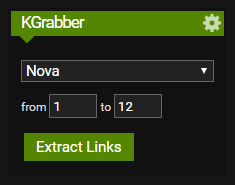
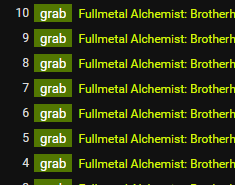

# KGrabber

Installing this will add a _KGrabber_ element to the right side of a show's page and _Grab_ buttons to each episode.

## Compatibility

Greasemonkey is _not_ supported.

The script is currently compatible with:

- kissanime.ru
- kimcartoon.to
- kissasian.sh
- kisstvshow.to

If you'd like to add a site, please open a new issue on GitHub.

## Installation and Usage

1. Add the [Tampermonkey](https://tampermonkey.net) extension to your browser
2. Install the script from [GreasyFork](https://greasyfork.org/en/scripts/383649)
3. Open the page you want to get links from
4. Select the server (unavailable servers are grayed out)
5. Enter the _from_ and _to_ episode numbers into the widget to the right and click _Extract Links_ to get the selected episodes
6. Solve any captchas that come up
7. Your links will be shown at the top of the page
